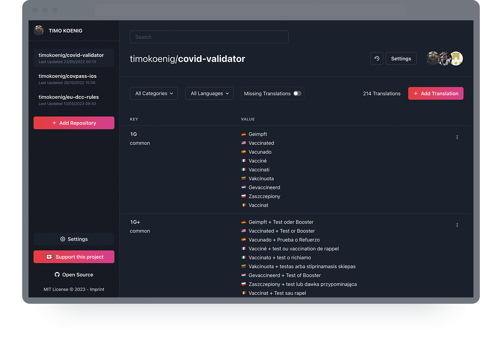

<div align="center" style="margin-bottom: 20px">
  
</div>

<br/>

<div align="center">
  Lightweight simple translation platform to manage your localizations
</div>

<br/>
<br/>

<div align="center">
  
</div>

## Getting Started

Set the following environment variables in the `.env` file.

```
GITHUB_ID=xxx
GITHUB_SECRET=xxx
NEXTAUTH_URL=http://localhost:3000
NEXTAUTH_SECRET=xxx
NEXT_PUBLIC_SECURE_LOCAL_STORAGE_HASH_KEY=xxx
NEXT_PUBLIC_SECURE_LOCAL_STORAGE_PREFIX=translate
```

Then run the following commands to install and build the application.

```
pnpm install
pnpm run build
```

You will be able to open the application in your browser with the URL `http://localhost:3000`.

You can also run the dev command for your local environment.

```
pnpm run dev
```

### Github OAuth App

Create a Github OAuth app to allow the user to sign-in and manage their repository translations.

You can find information on how to do it on the [offical Github website](https://docs.github.com/en/apps/oauth-apps/building-oauth-apps/creating-an-oauth-app).

After you created the app, set the environment variables `GITHUB_ID` and `GITHUB_SECRET` accordingly.

### NextAuth

The application uses NextAuth.js for the OAuth authentication. You need to set the environmment variable `NEXTAUTH_SECRET` ([more information](https://next-auth.js.org/configuration/options#secret)) and `NEXTAUTH_URL` ([more information](https://next-auth.js.org/configuration/options#nextauth_url)).

You can use openssl to generate a secret for you `openssl rand -base64 32`.

### Ko-Fi Support Button

Set the `NEXT_PUBLIC_KOFI_USERNAME` environment variable to enable the ko-fi support button.

### Imprint

Set the `NEXT_PUBLIC_IMPRINT_URL` environment variable with a URL to your imprint HTML to enable the imprint page.

## Why Translate?

While I developed a NextJS application with many different localizations, I was tired of editing the json files directly and copying keys from one language to another. The more keys you have and the more languages your application supports the more difficult it gets to manage them. **Translate** provides a simple web interface to manage all translations directly in your Github repository.

## How does it work?

TBD
